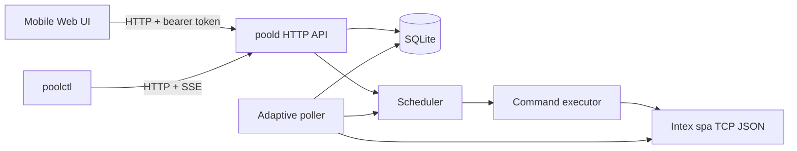
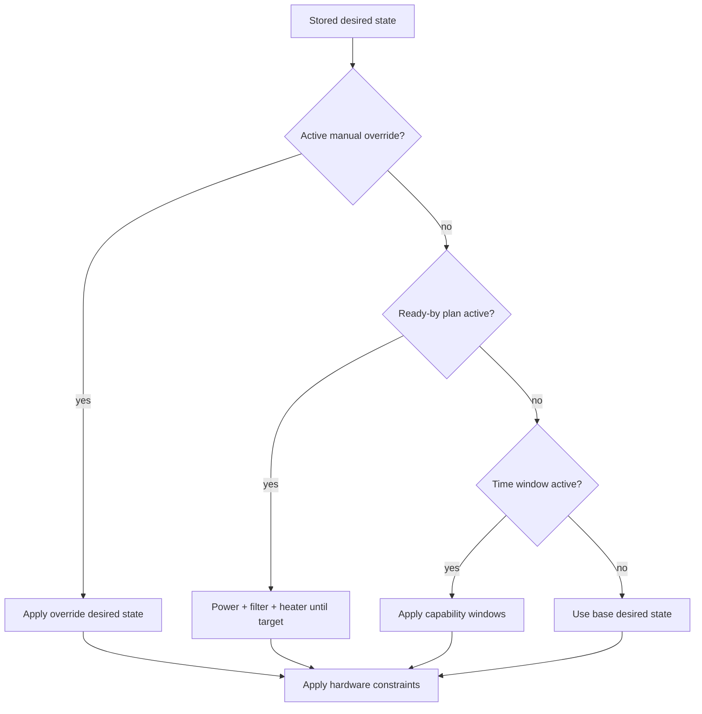
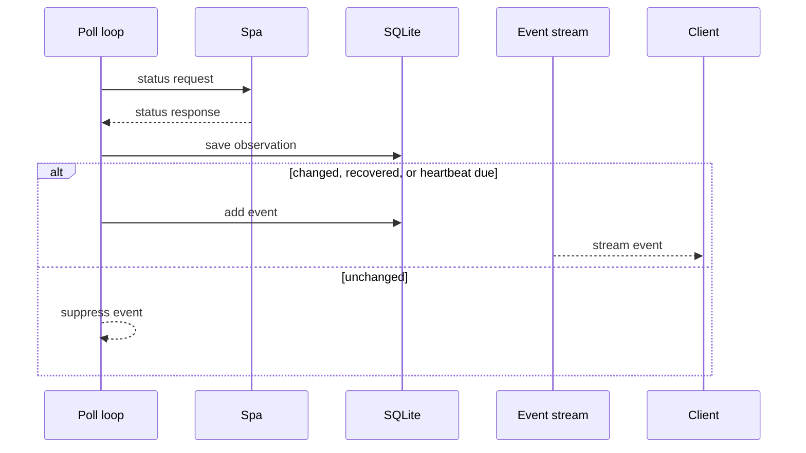

# poold

`poold` is a small pool-side daemon for Pooly. It runs next to an Intex spa, talks to the spa over its TCP JSON protocol, stores local state in SQLite, enforces desired state and schedules, and exposes an authenticated HTTP API, mobile web UI, and CLI-friendly event streams.

The repository builds two binaries:

- `poold`: the daemon, intended for OpenWrt or Linux.
- `poolctl`: a CLI client for status, commands, plans, and event watching.

## Architecture



`poold` is designed for a small edge host on the same LAN as the spa. Clients should reach it over a private network such as Tailscale. The daemon keeps short-term observations and deduplicated events locally; durable application history can live elsewhere.

## Features

- Mobile-friendly web control panel on the same port as the API.
- Bearer-token authenticated API.
- Current status, health, desired state, command, plan, event, and observation endpoints.
- CLI commands for status, direct commands, plans, ready-by schedules, filter windows, and live watching.
- Adaptive polling: startup, idle, active, stable, and error-backoff intervals.
- Local scheduler for ready-by, time-window, and manual-override plans.
- SQLite persistence for observations, events, commands, desired state, and plans.
- OpenWrt `procd` init script.

## Project Layout

```text
cmd/poold/                  daemon entrypoint and adaptive poll loop
cmd/poolctl/                CLI client
internal/config/            flags, environment, timezone data
internal/httpapi/           HTTP API, service layer, embedded web UI
internal/pool/              domain types and plan validation
internal/protocol/intex/    Intex TCP protocol client and status decoder
internal/scheduler/         plan evaluation and next-wake calculation
internal/store/             SQLite persistence
packaging/openwrt/init.d/   OpenWrt service script
```

## Quick Start

Requirements:

- Go `1.26.1` or newer matching `go.mod`.
- Network access from `poold` to the spa TCP endpoint.

Run the daemon locally:

```sh
go run ./cmd/poold
```

Defaults:

```text
HTTP API:  127.0.0.1:8090
Pool TCP:  127.0.0.1:8990
SQLite:    ./var/poold.db
Token:     dev-token
Timezone:  Europe/Berlin
```

Use the CLI:

```sh
go run ./cmd/poolctl status
go run ./cmd/poolctl watch
go run ./cmd/poolctl watch --all-polls
go run ./cmd/poolctl set heater on
go run ./cmd/poolctl set temp 36
```

Open the web UI:

```text
http://127.0.0.1:8090/
```

Enter the bearer token in the browser. The page stores it in `localStorage` and sends it with API calls.

## Configuration

Set options with environment variables or daemon flags.

| Environment variable | Default | Purpose |
| --- | --- | --- |
| `POOLD_LISTEN_ADDR` | `127.0.0.1:8090` | HTTP listen address |
| `POOLD_POOL_ADDR` | `127.0.0.1:8990` | Intex spa TCP address |
| `POOLD_DB_PATH` | `./var/poold.db` | SQLite database path |
| `POOLD_TOKEN` | `dev-token` | Bearer token for API calls |
| `POOLD_TIMEZONE` | `Europe/Berlin` | Local timezone for plans |
| `POOLD_HEATING_RATE_C_PER_HOUR` | `0.75` | Heating estimate for ready-by plans |
| `POOLD_READINESS_BUFFER` | `30m` | Extra lead time before ready-by target |
| `POOLD_POLL_STARTUP_INTERVAL` | `10s` | Retry interval before first successful poll |
| `POOLD_POLL_IDLE_INTERVAL` | `10m` | Poll interval when powered off |
| `POOLD_POLL_STABLE_INTERVAL` | `5m` | Poll interval when powered on but inactive |
| `POOLD_POLL_ACTIVE_INTERVAL` | `1m` | Poll interval while equipment is active |
| `POOLD_POLL_ERROR_MIN_INTERVAL` | `30s` | First error backoff interval |
| `POOLD_POLL_ERROR_MAX_INTERVAL` | `5m` | Maximum error backoff interval |
| `POOLD_COMMAND_CONFIRM_DELAY` | `10s` | Delayed refresh after commands |
| `POOLD_EVENT_HEARTBEAT` | `30m` | Max interval between unchanged event records |
| `POOLD_OBSERVATION_RETENTION` | `14d` | Observation retention |
| `POOLD_EVENT_RETENTION` | `14d` | Event retention |

`POOLD_POLL_INTERVAL` is accepted as a compatibility alias for `POOLD_POLL_STABLE_INTERVAL`.

CLI defaults:

| Environment variable | Default | Purpose |
| --- | --- | --- |
| `POOLCTL_URL` | `http://127.0.0.1:8090` | Base URL for `poold` |
| `POOLCTL_TOKEN` | `POOLD_TOKEN` or `dev-token` | Bearer token |
| `POOLCTL_TIMEZONE` | `Europe/Berlin` | Display timezone |

## Web UI

The web UI is embedded in the daemon and served by `GET /`. It has no frontend build step and is intended to work well from a phone.

It supports:

- Current temperature, target temperature, connection state, equipment state, and last observation.
- Fast pause/resume for short power breaks.
- Direct power, filter, heater, jets, bubbles, and sanitizer commands.
- Target temperature changes.
- Desired-state editing with `Any`, `Off`, and `On` states.
- Plan list, toggle, and delete.
- Ready-by plan creation.
- Time-window plan creation.
- Manual heater override creation.
- Recent events, polls, and command activity.

The web shell itself is public, but all data and actions still require the bearer token.

The pause control creates a temporary manual-override plan named `webui-pause` that forces power, filter, heater, jets, bubbles, and sanitizer off. Resume removes that plan so normal desired state and schedules can take over again.

## CLI

```sh
poolctl status
poolctl watch [--json] [--all-polls] [--from-start] [--after <id>]
poolctl set temp 36
poolctl set heater on|off
poolctl set filter on|off
poolctl plans list
poolctl plans apply <file>
poolctl ready-by --temp 36 --at "Sat 08:30"
poolctl filter --from "02:00" --to "04:00"
```

`poolctl watch` shows deduplicated events. `poolctl watch --all-polls` shows every stored successful status observation.

## Scheduler Model



Plan precedence is:

1. Active manual override.
2. Active ready-by plan.
3. Time-window plans.
4. Stored desired state.

Hardware constraints are applied before enforcement. For example, heater-on implies filter-on and power-on. Omitted desired-state fields remain `Any` in storage and API responses; they are only filled in while calculating commands.

Time-window plans turn a capability on while the window is active. Outside the window, that capability returns to the stored desired state instead of being forced off.

## API

All API endpoints except `GET /` require:

```http
Authorization: Bearer <token>
```

### Endpoints

| Method | Path | Description |
| --- | --- | --- |
| `GET` | `/` | Web UI shell |
| `GET` | `/health` | Process and latest pool connection health |
| `GET` | `/status` | Refresh and return current spa status |
| `GET` | `/events?after=<id>&limit=<n>` | Deduplicated event history |
| `GET` | `/events?latest=1&limit=<n>` | Latest events in descending order |
| `GET` | `/events/stream` | Server-sent event stream |
| `GET` | `/observations?after=<id>&limit=<n>` | Stored poll observations |
| `GET` | `/observations?latest=1&limit=<n>` | Latest observations in descending order |
| `GET` | `/observations/stream` | Server-sent observation stream |
| `GET` | `/desired-state` | Stored base desired state |
| `PUT` | `/desired-state` | Replace base desired state |
| `GET` | `/plans` | List plans |
| `PUT` | `/plans` | Replace plans |
| `POST` | `/commands` | Execute one command |

### Command Example

```json
{
  "capability": "heater",
  "state": true,
  "source": "poolctl"
}
```

Set target temperature:

```json
{
  "capability": "target_temp",
  "value": 36,
  "source": "webui"
}
```

### Desired State Example

```json
{
  "power": true,
  "filter": true,
  "heater": true,
  "target_temp": 36
}
```

Use omitted fields to leave a capability unmanaged by the base desired state. For example, `{"heater": true, "target_temp": 36}` stores power and filter as `Any`, but enforcement still turns them on because the heater needs them.

### Plan Examples

Ready-by:

```json
{
  "id": "saturday-ready",
  "type": "ready_by",
  "name": "Saturday morning",
  "enabled": true,
  "target_temp": 36,
  "at": "2026-05-09T08:30:00+02:00"
}
```

Time window:

```json
{
  "id": "daily-filter",
  "type": "time_window",
  "name": "Daily filter",
  "enabled": true,
  "capability": "filter",
  "from": "02:00",
  "to": "04:00",
  "days": ["mon", "tue", "wed", "thu", "fri", "sat", "sun"]
}
```

Manual override:

```json
{
  "id": "override-1h",
  "type": "manual_override",
  "name": "Heat now",
  "enabled": true,
  "desired_state": {
    "power": true,
    "filter": true,
    "heater": true
  },
  "expires_at": "2026-05-03T18:00:00+02:00"
}
```

## Event and Poll Behavior

`poold` saves every successful status refresh as an observation. Events are intentionally deduplicated:

- A status event is recorded when meaningful status changes.
- A recovery after an error records a status event.
- An unchanged status records a heartbeat event after `POOLD_EVENT_HEARTBEAT`.
- Repeated identical errors are suppressed until the heartbeat interval.

This keeps `poolctl watch` readable while `poolctl watch --all-polls` and `/observations` remain available for full poll visibility.



## Build

Native build:

```sh
go build -o dist/poold ./cmd/poold
go build -o dist/poolctl ./cmd/poolctl
```

OpenWrt MIPS build:

```sh
mkdir -p dist/openwrt-mips
GOOS=linux GOARCH=mips GOMIPS=softfloat CGO_ENABLED=0 \
  go build -trimpath -ldflags='-s -w' -o dist/openwrt-mips/poold ./cmd/poold
GOOS=linux GOARCH=mips GOMIPS=softfloat CGO_ENABLED=0 \
  go build -trimpath -ldflags='-s -w' -o dist/openwrt-mips/poolctl ./cmd/poolctl
```

The binaries are statically linked.

## OpenWrt Deployment

Copy the daemon and init script:

```sh
scp dist/openwrt-mips/poold root@<router>:/usr/bin/poold
scp packaging/openwrt/init.d/poold root@<router>:/etc/init.d/poold
ssh root@<router> 'chmod 755 /usr/bin/poold /etc/init.d/poold'
```

Set environment variables in the init environment or adapt the init script:

```sh
export POOLD_TOKEN='replace-me'
export POOLD_LISTEN_ADDR='100.x.y.z:8090'
export POOLD_POOL_ADDR='192.168.x.y:8990'
```

Enable and start:

```sh
ssh root@<router> '/etc/init.d/poold enable && /etc/init.d/poold start'
```

Logs are written to the OpenWrt system log:

```sh
ssh root@<router> 'logread -e poold'
ssh root@<router> 'logread -f -e poold'
```

The provided init script uses `/var/lib/poold/poold.db`, `procd` respawn, and waits for the configured Tailscale listen address to appear before starting.

## Development

Run tests:

```sh
go test ./...
```

Run formatting:

```sh
gofmt -w cmd internal
```

Useful local checks:

```sh
go run ./cmd/poold -listen 127.0.0.1:8090
go run ./cmd/poolctl -url http://127.0.0.1:8090 -token dev-token status
```

## Security Notes

- Do not expose `poold` on WAN.
- Prefer binding to a Tailscale IP or loopback.
- Use a strong bearer token in production.
- Do not commit real tokens, production SQLite databases, Tailscale IPs, or device-specific pool addresses.
- The web UI stores the token in browser `localStorage`; use it only from trusted devices.
