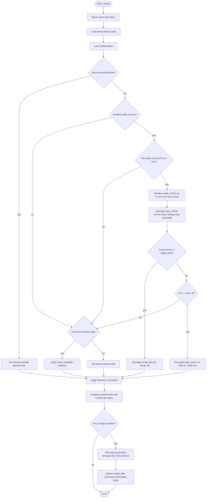
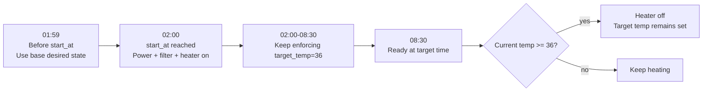

# Ready At Plan

A "Ready at" plan is stored as a `ready_by` plan. It asks poold to make the spa reach a target temperature by either a specific local date/time or a recurring crontab-style schedule.

One-shot example:

```json
{
  "id": "ready-by-1778270000",
  "type": "ready_by",
  "name": "Ready by Sat 08:30",
  "enabled": true,
  "target_temp": 36,
  "at": "2026-05-09T08:30:00+02:00"
}
```

Recurring example:

```json
{
  "id": "ready-by-weekend",
  "type": "ready_by",
  "name": "Weekend morning",
  "enabled": true,
  "target_temp": 36,
  "cron": "30 8 * * sat,sun"
}
```

The plan does not start heating immediately. On each status refresh, the scheduler estimates when heating must begin:

```text
degrees_to_heat = max(target_temp - current_temp, 0)
required_time   = degrees_to_heat / POOLD_HEATING_RATE_C_PER_HOUR
start_at        = ready_at - required_time - POOLD_READINESS_BUFFER
```

Defaults:

- `POOLD_HEATING_RATE_C_PER_HOUR=0.75`
- `POOLD_READINESS_BUFFER=30m`
- `POOLD_TIMEZONE=Europe/Berlin`

## Scheduler Flow



## Timeline Example

Assume:

- Current temperature: `30 C`
- Target temperature: `36 C`
- Ready at: `08:30`
- Heating rate: `1 C/hour`
- Readiness buffer: `30m`

The scheduler needs `6h` of heating plus a `30m` buffer, so it starts at `02:00`.



## Recurring Cron

A recurring Ready at plan uses a five-field cron expression:

```text
minute hour day-of-month month day-of-week
```

Examples:

- `30 8 * * 6`: every Saturday at `08:30`.
- `30 8 * * sat,sun`: every Saturday and Sunday at `08:30`.
- `0 18 * * mon-fri`: weekdays at `18:00`.

The scheduler resolves the next matching local occurrence and calculates that occurrence's `start_at`. After the ready minute has passed, the plan rolls forward to the next cron occurrence instead of remaining active forever.

## Precedence

Only one scheduler source wins for a given evaluation:

1. Active manual override.
2. Active `ready_by` plan.
3. Active time-window plans.
4. Stored desired state.

This means an active manual override can suppress a Ready at plan. A Ready at plan that is active takes precedence over normal filter/heater time windows.

## Important Behavior

- A one-shot plan uses `at`; a recurring plan uses `cron`. A plan must not set both.
- The plan remains enabled until it is deleted or disabled. In the dashboard this is the Active yes/no setting.
- If `current_temp` is missing, the scheduler assumes the spa is already at `target_temp`, so it will not start early heating from an unknown temperature.
- If a one-shot target has already been reached, the ready plan can hold the target immediately by turning the heater off while keeping the target temperature set. Recurring plans only do this during the active ready window, so they do not suppress other plans all day before the next occurrence.
- The scheduler wakes at the calculated `start_at` and at `ready_at`, so poold can react even when the normal poll interval would otherwise be later.
